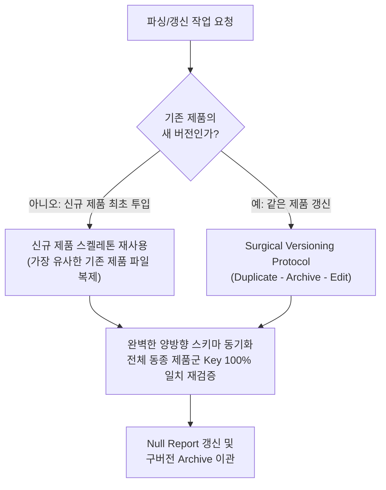

# Audio Equipment Spec Parsing Skill

**Skill_Version: 1.14** (파일명 관례: SKILL_v1.14.md)

## 버전 이력

전체 버전 이력(v1.0~현재)은 루트의 `SKILL_Changelog.md`에 분리 보관한다(v1.13부터). 이 본문에는 이력 표를 싣지 않는다 — 과거 버전의 변경 배경이 필요할 때만 그 파일을 읽는다. 새 버전을 만들 때는 그 파일 하단 표에 항목을 추가하며, 각 구버전 원문 전체는 `Archive/Archive_Skill/`에 보존되어 있다.

이 스킬은 음향 기기(앰프, 스피커, 컨트롤러 등) 스펙 데이터를 여러 출처(오너 매뉴얼, 스펙시트 PDF, A&E 시방서, 웹사이트 계층별 텍스트)에서 추출하여 하나의 마스터 스키마 마크다운으로 통합한다. 대상 실행 환경은 Claude Sonnet 계열(주력, 대량 반복 파싱 — v1.13 기준 Sonnet 5에서 검증)과 상위 모델(Opus/Fable 계열, 보조 — 복잡한 매뉴얼/충돌 해결)이며, 주력인 Sonnet 기준으로 지침 경계를 명확히 설계한다.

문서 구조는 마크다운 골격 + XML 국소 삽입 하이브리드를 따른다: 워크플로/규칙 서술은 마크다운 헤더로, 예시 입출력 쌍·용어 매핑 사전·데이터 블록처럼 원문과 경계가 흐려지기 쉬운 부분은 XML 태그로 격리한다. 최종 산출물(파싱 결과)의 포맷은 항상 마크다운(.md)이다.

## 핵심 파싱 원칙

<core_principles>
1. **스키마 동적 발견**: 제조사마다 다른 용어(예: "Max Power", "최대 출력")를 공학 표준 스네이크 케이스 영문 키로 통합한다(예: `Rated_Power_Per_Ch_2.7_Ohms_W`).
   - **브랜드 고유 신규 섹션 신설 허용 (v1.9)**: 신규 브랜드 투입 시 기존 마스터 스키마의 어느 섹션/Key와도 정확히 대응되지 않는 스펙 항목군이 다수 발견되면(예: d&b D80의 CMRR, S/N ratio, LoadMatch 케이블 보상, 선택형 출력 모드 등), 억지로 기존 Key에 끼워 맞추거나 임의로 재해석하지 않고 `[브랜드/제품명]_specific` 형태의 신규 섹션을 만들어 별도로 기록한다. 이 신규 섹션도 양방향 동기화 대상이며, 기존 제품 파일들에는 동일 Key를 null로 소급 반영한다.
2. **데이터 정제**: 값에서 단위를 분리하고 계산 가능한 숫자로 변환한다. 표 안에는 정제된 값만 남긴다 (자세한 규칙은 "표 순수성" 절 참조).
   - **저항값(Impedance) 표기 표준화 (Value와 Key 모두 적용)**: 유럽식 표기(예: `2R7`, `4R`, `8R`)는 소수점 표기(`2.7`, `4`, `8`)로 변환한다. 이 변환은 표의 Value 칸뿐 아니라 동적으로 생성하는 속성명(Key)에도 예외 없이 동일하게 적용한다.
     - Value: Unit 컬럼에 Ohm이 명시되어 있으면 Value는 순수 숫자만 남긴다. 예: 원문 `2R7` -> Value `2.7`, Unit `Ohm`.
     - Key: 저항 조건이 키 이름에 들어갈 때는 `<숫자>.<숫자>_Ohms` 또는 정수면 `<숫자>_Ohms` 형태의 스네이크 케이스로 치환한다. 예: `Rated_Power_Per_Ch_2R7` -> `Rated_Power_Per_Ch_2.7_Ohms`, `Rated_Power_Per_Ch_4R` -> `Rated_Power_Per_Ch_4_Ohms`, `Rated_Power_Per_Ch_8R` -> `Rated_Power_Per_Ch_8_Ohms`.
     - 키 이름에 유럽식 표기(`2R7` 등)를 관용적으로 남겨두는 것은 더 이상 허용하지 않는다 — Key와 Value 양쪽 모두 사람이 바로 읽을 수 있는 표준 표기여야 한다.
3. **측정 기준 별도 관리**: 오너 매뉴얼 등에 있는 측정 조건(-3dB, RMS, 핑크노이즈, 버스트 길이 등)은 표 안에 넣지 않고 주석/출처 섹션으로 분리한다.
4. **무결성 유지 (엄격)**: 없는 스펙은 억지로 만들지 않고 `null` 처리한다. 소스 간 값이 다르면 어느 한쪽도 버리지 않고 둘 다 보존한다(자세한 규칙은 "데이터 충돌 보존" 절 참조).
   - **임의 추론/수식어 첨가 절대 금지**: 원본 어느 문서에도 없는 수식어, 마케팅 문구, 괄호 설명, 해설성 표현을 표의 Value에 절대 덧붙이지 않는다. 여러 소스의 표현이 다를 경우(예: 한 소스는 "Class D", 다른 소스는 "High-efficiency Class D") 이를 동일한 사실로 조용히 병합해서는 안 되며, 반드시 "데이터 충돌 보존 원칙"에 따라 각주로 두 표현을 모두 노출하고 어느 소스에서 어느 표현이 나왔는지 명시한다. Value 컬럼에는 수식어가 없는 가장 보수적인 표현을 기본값으로 쓰고, 확장된 표현은 각주에서만 다룬다. 한 소스에만 등장한 문구를 다른 소스에도 있었던 것처럼 표기하는 것은 명백한 지침 위반이다.
   - 이 원칙은 숫자 계산에도 동일하게 적용된다: 소스에 명시적으로 기재되지 않은 합산·곱셈 등 파생값(예: 채널 수 × 채널당 출력)을 임의로 계산하여 새로운 스펙 값을 만들어내지 않는다. 총량 스펙이 필요하면 반드시 소스 문서에 그 값이 명시적으로 기재되어 있는 경우에만 채택한다.
   - **총량/정격 Key 오염 금지**: `Total_Power_Capability`처럼 "총량/정격"의 의미가 이미 확정된 Key에는, 이름은 유사하지만 실제 성격이 다른 값(예: 개별 채널 출력의 단순 합, AC 메인즈 입력 전력 정격, 순간 피크 전력 등)을 대입하지 않는다. 소스 문서에서 어떤 숫자를 채택하기 전에 그 숫자가 정확히 어느 물리량을 가리키는지(총 출력 용량인지, 메인즈 입력 정격인지, 특정 조건의 순간치인지)를 먼저 확인하고, 확신이 서지 않으면 해당 Key는 `null`로 두고 그 숫자는 성격에 맞는 별도 Key를 새로 만들어 기록한다.
   - **표기 기준이 다른 동일 물리량의 임의 변환 금지 (v1.9 신규)**: 서로 다른 브랜드가 동일한 물리 현상(예: 채널 간 누화)을 서로 다른 부호/기준점 표기로 제공하는 경우(예: 한 브랜드는 "greater than 85 dB", 다른 브랜드는 "less than -70 dBr"), 두 표기가 실질적으로 동일한 성능 방향을 가리키는지 확정할 수 없다면 임의로 부호를 바꾸거나 절대값으로 환산하지 않는다. 각 제품 파일에는 원문 표기를 그대로 보존하고, 매핑 근거와 표기 방식 차이를 각주로 명기한다.
   - **확정된 비존재(0)와 미확인(null)의 구분 (v1.9 신규)**: 소스 문서 전체를 스캔했음에도 특정 기능/커넥터에 대한 언급이 전혀 없어 "그 기능 자체가 제품에 존재하지 않는다"고 합리적으로 판단할 수 있는 경우(예: GPIO 관련 용어가 매뉴얼 전체에서 0건 검출), 이는 단순 `null`(정보 부족으로 미확인)이 아니라 개수형 Key라면 `0`(확정적 비존재)으로 명시할 수 있다. 다만 이 판단은 해당 소스 문서를 전량 스캔(전문 검색 등)한 근거가 있을 때만 내리며, 근거를 각주에 명기해야 한다. 단순히 일부 챕터만 훑고 못 찾았다고 0으로 단정하지 않는다.
     - **판단 근거의 원본성 요건 (v1.11 신규)**: 위 "전량 스캔"은 반드시 해당 제품 자신의 원본 소스 문서(OM/SPS/AE 등)를 대상으로 수행해야 한다. 다른 제품의 기존 파싱 결과물 텍스트(예: 타 제품 마스터 스키마 파일의 각주)만을 근거로 "이 제품에도 해당 개념이 없을 것"이라 유추하는 것은 전량 스캔으로 인정하지 않는다 — 이 경우 아무리 정황상 확실해 보여도 `0`이 아닌 `null`(미확인)로 보수적으로 유지하고, 각주에 "원본 재조회 없이 기존 파싱 결과 텍스트만으로 판단했으므로 미확인 처리" 취지를 명시한다(LA12X v2.9에서 브릿징/AES67 관련 신규 Key를 원본 OM 재검토 없이 null로 유지한 사례에서 확립).
5. **PDF 문서 분석 및 이미지 처리 규칙**: 자세한 내용은 "PDF 문서 분석 및 이미지 처리" 절 참조.
6. **완벽한 양방향 스키마 동기화**: 자세한 내용은 "완벽한 양방향 스키마 동기화" 절 참조.
7. **작업 공간 관리 및 버전 체계화**: 자세한 내용은 "작업 공간 관리 및 버전 체계화" 절 참조.
</core_principles>

## PDF 문서 분석 및 이미지 처리 (v1.5)

<pdf_analysis_rules>
- **텍스트 우선 스캔**: 업로드된 오너 매뉴얼 등 PDF 문서를 분석할 때는 제품 외관 사진, 장식적 이미지 등 스펙과 무관한 이미지 분석에 리소스를 소모하지 않는다. 텍스트 레이어(표, 단락, 도면에 내장된 텍스트 라벨 포함)를 우선 추출하여 스펙을 구성한다.
- **예외적 이미지 분석 허용**: 다만 I/O 단자의 극성(+ / -), 위상(Phase), 핀 배열 등 텍스트로 추출되지 않고 순수 그래픽/아이콘으로만 표기된 기호적 정보가 의심되는 경우에 한해, 해당 영역의 이미지를 예외적으로 면밀히 분석하여 스키마에 반영한다.
- 텍스트 레이어에 이미 극성/핀 정보가 문자로 명시되어 있다면(예: "1 + signal pin", "1 - signal pin") 이는 텍스트 우선 스캔만으로 충분하며 별도 이미지 분석은 수행하지 않는다.
</pdf_analysis_rules>

## 원본 데이터 보존 규칙 (v1.6)

<raw_data_preservation_rules>
- **원본 문서 보존**: 사용자가 입력한 오너 매뉴얼 PDF, 스펙시트 PDF, A&E 시방서 등 원본 문서 파일은 해당 제품의 카테고리/브랜드 폴더 내 `Original_PDFs` 폴더(`{category}/{brand}/Original_PDFs/{제품명}/`)를 생성하여 그대로 보존한다. 파싱 과정에서 원본 파일 자체를 수정하지 않는다.
- **웹 텍스트 원문 보존**: 사용자가 복사해 입력한 웹사이트 텍스트 데이터(리스트뷰/오버뷰/Full Spec 등 계층별)는 파싱 결과물과 별개로, 글자 하나 바꾸지 않고 입력 순서 그대로 단일 마크다운 파일로 병합하여 해당 카테고리/브랜드 폴더의 `Raw_Web_Data` 폴더(`{category}/{brand}/Raw_Web_Data/`)에 `[제품명]_Raw_Web_Data.md` 형식으로 저장한다. txt로 입력된 A&E 시방서 등 비-웹 텍스트 원문도 동일 파일에 별도 소스 헤더(예: "AE")로 구분하여 병합 보존할 수 있다.
- **적용 범위**: 본 절의 규칙은 이 프로젝트 전용 SKILL.md 문서에만 적용된다. 세션의 시스템 레벨 전역 설정 파일(CLAUDE.md 등)은 본 스킬의 파싱 워크플로와 별개의 문서이며, 대화 중 지시만으로 수정 대상이 되지 않는다.
</raw_data_preservation_rules>

## 완벽한 양방향 스키마 동기화 (v1.7)

<bidirectional_sync_rules>
- **마스터 스키마 통일 원칙**: 동종 제품군(같은 브랜드 또는 같은 카테고리로 함께 관리되는 제품군)에 속한 모든 마스터 스키마 마크다운 파일은 예외 없이 완벽하게 동일한 Key(속성명) 목록과 마크다운 구조(섹션 계층)를 가져야 한다.
- **양방향 업데이트 의무**: 신규 제품을 파싱하여 스키마가 확장될 때, "신규 제품에서 발견된 새 Key를 기존 제품 파일에 `null`로 추가"하는 것만으로 끝내지 않는다. 반대로 "기존 제품 파일에만 있던 Key" 역시 신규 제품의 결과물에 빠짐없이 추가하고(해당 제품에 적용되지 않거나 값이 없으면 `null` 처리), 두 파일의 Key 구성이 100% 일치하도록 양방향으로 동기화한다.
- 이 규칙은 Phase 3-1(동종 브랜드 이기종 채널)부터 적용되며, 특정 부하 조건처럼 제품 아키텍처상 원천적으로 적용되지 않는 Key라도 삭제하지 않고 `null`로 남겨, 왜 해당 제품에 그 값이 없는지(비적용 vs 미확인)를 각주로 구분해 설명한다.
- **신규 섹션 단위 동기화 (v1.9 확인)**: Phase 3-2처럼 완전히 다른 브랜드가 투입되어 `[브랜드]_specific` 신규 섹션이 생성되는 경우에도 이 규칙은 동일하게 적용된다 — 신규 섹션의 모든 Key는 기존 제품 파일들에도 동일하게 추가되어야 하며(대부분 null), 섹션 자체를 생략하지 않는다.
- **동기화 대상 Key의 범위 제한 — "브랜드 고유 물리/명칭 Key"는 동기화하지 않는다 (v1.14 신규)**: 위의 "특정 부하 조건" 같은 예시는 부하 임피던스처럼 *브랜드 무관하게 어느 제조사든 보고할 수 있는 범용 측정/스펙 개념*에 한정된다. 이와 구분되는 별도 유형이 있다 — Key 이름 자체가 **한 브랜드/제품의 고유한 물리적 설계나 부품·커넥터 모델명을 그대로 지칭**하는 경우다(예: d&b GSL의 전방/측면 LF 드라이버 배선 채널 구분을 그대로 옮긴 `Front_LF_Transducer`/`Side_LF_MF_HF_Nominal_Impedance`, GSL의 커넥터 모델명을 그대로 딴 `NLT4_Pinout_Pin1`, L-Acoustics의 커넥터 모델명을 그대로 딴 `PA_COM_Pinout_AB`, d&b의 명명된 기능을 그대로 딴 `CUT_Mode_*`). 이런 Key는:
  - **판별 기준**: "이 Key 이름을 다른 브랜드 제품에 붙였을 때, 그 브랜드가 실제로 이 개념을 갖고 있는지와 무관하게 이름 자체가 의미를 갖는가?"를 자문한다. 범용 측정 개념(예: `Max_SPL_4x_Array_Far_Field_Scaled_1m` — "4대 어레이 시 SPL"은 어느 브랜드든 측정·보고할 수 있는 개념)이면 계속 null로 동기화한다. 반면 Key 이름 자체에 특정 브랜드의 부품명·커넥터 모델명·기능명이 박혀 있어 그 브랜드 문서를 몰라도 이름만으로 "이건 GSL 얘기구나"를 알 수 있는 경우(예: `NLT4`, `Front_LF`, `CUT_Mode`)는 브랜드 고유 Key다.
  - **처리 방법**: 브랜드 고유 Key는 그 브랜드의 파일에는 실값으로 유지하되, 다른 브랜드 파일에는 null로 끌어와 "채워 넣지" 않고 **아예 생성하지 않는다**(삭제 대상). 각 제품은 자기 자신의 동등 개념을 자기 자신의 Key로 이미 표현하고 있어야 한다(예: L-Acoustics는 PA-COM 커넥터 자신의 핀아웃을 `PA_COM_Pinout_*`로, GSL은 자신의 NLT4 핀아웃을 `NLT4_Pinout_*`로 — 서로의 파일에 상대방 Key를 null로 옮기지 않는다). 이렇게 하면 Null Report가 "이 브랜드 문서가 부실해서 없다"는 신호와 "이 브랜드에는 애초에 이 개념이 없다"는 신호를 뒤섞지 않게 된다.
  - **적용 사례(2026-07-16, speakers 카테고리)**: GSL8/GSL12 투입 후 K1/PANTHER에 비적용 null로 동기화됐던 `Front_LF_Transducer`, `Side_LF_Transducer`, `Front_LF_Nominal_Impedance`, `Side_LF_MF_HF_Nominal_Impedance`, `Power_Handling_Front_LF_RMS`, `Power_Handling_Front_LF_Peak_10ms`, `Power_Handling_Side_LF_MF_HF_RMS`, `Power_Handling_Side_LF_MF_HF_Peak_10ms`, `NLT4_Pinout_Pin1`, `NLT4_Pinout_Pin2`를 삭제하고, 반대로 K1/K2에서 GSL/PANTHER로 동기화됐던 `PA_COM_Pinout_AB/CD/EF/GH`도 동일 원칙으로 삭제했다. 반면 같은 라운드에 함께 검토된 `Max_SPL_4x_Array_Far_Field_Scaled_1m`(범용 측정 조건), `MF_Transducer`류(3-way/2-way 구분이라는 범용 웨이 구조 개념), `RMS_Power_Handling_LF/MF/HF`(K1이 이미 보유한 범용 LF/MF/HF 대역 구조를 그대로 사용, 브랜드 고유 배선명이 아님)는 계속 null 동기화 대상으로 유지했다.
</bidirectional_sync_rules>

## 작업 공간 관리 및 버전 체계화 (v1.8)

<workspace_versioning_rules>
- **기존 파일 수정 금지**: 이미 작업 폴더(루트 또는 Archive)에 저장된 파일의 내용을 직접 덮어쓰거나 편집(Edit)하지 않는다. 지침이나 스키마가 갱신될 때는 예외 없이 버전을 올린 새 마크다운 파일을 새로 생성한다. 파일 도구 상 기존 파일을 편집해야만 하는 경우(예: 이전 세션에서 이미 잘못 덮어써진 파일을 발견한 경우)에는, 먼저 올바른 내용을 별도의 새 파일로 만든 뒤 훼손된 파일을 Archive로 옮기거나 삭제 요청하는 방식으로 처리한다.
- **`_latest` 태그 사용 금지**: 파일명에 `_latest`, `_final`, `_current` 등 비-숫자 상태 태그를 붙이지 않는다. 버전 식별은 오직 파일명의 숫자 버전으로만 한다.
- **시맨틱 버저닝 (`[이름]_v[Major].[Minor].md`)**:
  - **Minor 업데이트** (`v1.0 -> v1.1`): 신규 Key 추가, 완벽한 양방향 스키마 동기화 반영, 단순 오기입/오기재 수정, 세부 지침·각주 보강 등 기존 스키마 구조와 하위 호환되는 변경.
  - **Major 업데이트** (`v1.0 -> v2.0`): 마스터 스키마의 섹션 계층 구조가 재편되거나, 파싱 룰(용어 매핑, 충돌 보존 방식, 출력 포맷 등)이 전면 개편되어 이전 버전과 문서 형식 자체가 달라지는 변경.
  - 단순 각주 오류 수정, 저항 표기 등 명명 규칙의 전면 재적용처럼 "많은 셀에 영향을 주지만 스키마 구조 자체는 그대로인" 변경은 Major가 아니라 Minor로 분류한다.
  - 신규 브랜드 투입으로 `[브랜드]_specific` 섹션이 통째로 추가되는 경우도, 기존 섹션의 계층 구조 자체는 바뀌지 않으므로 Minor로 분류한다(Phase 3-2 D80 사례에서 확인).
- **루트 디렉토리 구성 원칙 (v1.12 갱신, v1.13 보강)**: 작업 폴더 루트에는 `SKILL_v*.md`, `Session_Transfer_v*.md` 등 카테고리에 종속되지 않는 전역 최신 버전 파일 1개씩과, append-only 전역 문서인 `SKILL_Changelog.md`(v1.13 신설 — SKILL 버전 이력 전용, 버전 접미사 없이 하단에 항목 추가만 허용되는 예외 문서), 그리고 제품 카테고리 폴더(현재 `amplifiers/`, 향후 `speakers/`, `amp_racks/` 등)만 둔다. 제품 마스터 스키마 파일과 `Original_PDFs`/`Raw_Web_Data` 운영 폴더는 더 이상 루트에 직접 두지 않고, 반드시 `{category}/{brand}/` 하위(예: `amplifiers/LA/`, `amplifiers/db/`)에 둔다. 신규 카테고리 투입 시에도 동일한 `{category}/{brand}/{제품명}_v*.md` + `Original_PDFs` + `Raw_Web_Data` + `Archive` 내부 구조를 그대로 재사용한다.
- **Archive 폴더 (v1.12 갱신)**: 새 버전 파일이 생성되어 특정 파일이 더 이상 최신이 아니게 되면, 그 구버전 파일은 방치하지 않고 즉시 알맞은 Archive 위치로 옮긴다. 카테고리에 종속되지 않는 전역 문서(스킬 지침 구버전, 세션 전달 구버전)는 루트 `Archive/` 하위의 `Archive_Skill`, `Archive_Meta`로 이관한다. 제품 마스터 스키마 구버전은 루트 `Archive/Archive_Data`가 아니라 해당 브랜드 폴더 내부의 `{category}/{brand}/Archive/{제품명}/`으로 이관한다 — 브랜드 폴더 자체가 이미 카테고리/브랜드로 범위가 좁혀져 있으므로 별도의 "_Data" 접미사가 필요 없다. 파일 이동(archiving)은 새 위치에 사본을 만든 뒤 원래 위치의 파일 삭제 권한을 요청하여 완료한다.
- **Surgical Versioning Protocol: Strict Sequence (수술적 버전업 규칙, 엄격한 순차 실행, v1.10 신규)**: 기존 마스터 스키마/스킬 문서를 갱신하여 새 버전 파일을 만들 때는 절대 백지(스크래치)부터 다시 작성하지 않는다. 기존 파일의 오염을 막기 위해 아래 시간적 순서(1→2→3)를 엄격하게 지켜야 하며, **절대 Edit(수정)을 먼저 시작하지 않는다.**

  ```mermaid
  flowchart LR
      D["1. Duplicate<br/>구버전을 새 버전 파일명으로 복제<br/>(어떤 내용도 수정하지 않음)"] --> A["2. Archive<br/>순수 원본 구버전을<br/>알맞은 Archive 위치로 이동"] --> E["3. Surgical Edit<br/>새 파일에서 변경 대상만<br/>최소 범위로 수정"]
  ```

  버전업 작업 시 아래 체크리스트를 응답에 복사하여 단계별로 완료를 체크한다 — 앞 단계가 체크되기 전에는 다음 단계를 시작하지 않는다:

  ```
  버전업 진행 상황:
  - [ ] Step 1 (Duplicate): 구버전 파일을 새 버전 파일명으로 복제 완료 (Edit 미실행 상태)
  - [ ] Step 2 (Archive): 순수 원본 구버전을 Archive 위치로 이동 완료 확인
  - [ ] Step 3 (Surgical Edit): 새 파일에서 이번 변경 대상만 최소 범위 수정
  - [ ] Step 4 (기록): SKILL 버전업인 경우 SKILL_Changelog.md 하단에 항목 추가
  ```

  1. **Duplicate FIRST (복제, 최우선)**: 가장 먼저 기존 구버전 파일(예: v1.9)을 복사하여 동일한 내용의 새 파일(예: v1.10)을 생성한다. 이 단계에서는 절대 내용을 수정하지 않는다 — 원본 구버전 파일도 이 시점까지는 그대로 건드리지 않는다.
  2. **Archive SECOND (보관)**: 새 파일 복제가 완료된 직후, 원본 구버전 파일을 즉시 알맞은 Archive 위치로 이동시켜 안전하게 격리한다 — 스킬 지침이면 루트 `Archive/Archive_Skill`, 제품 마스터 스키마면 해당 `{category}/{brand}/Archive/{제품명}/` (v1.12 기준). 이 시점의 구버전 원본은 Step 1에서 전혀 수정되지 않은 순수 원본이어야 한다.
  3. **Surgical Edit THIRD (수술적 수정)**: 구버전 원본의 격리가 완료된 후, 비로소 새로 생성된 파일(v1.10)을 열어 이번 변경 요청과 직접 관련된 정확한 대상(Key/Value/각주/버전 이력 등)만 최소 범위로 수정한다. 변경과 무관한 기존 문장, 각주, 서식, 예외 처리 서술은 한 글자도 건드리지 않는다.
  - **위반 사례와 교훈**: 이 규칙이 처음 도입된 v1.10 라운드에서, 실제로는 원본(v1.9)을 먼저 Edit으로 수정한 뒤 그 결과를 새 파일(v1.10)로 복제하고 나서야 원본을 Archive로 옮기는 잘못된 순서가 발생했다. 그 결과 Archive에 격리된 "v1.9" 파일이 실제로는 이미 v1.10의 수정 내용을 담고 있는 오염된 상태로 보관되는 사고로 이어졌으며, Archive의 v1.8을 기준으로 순수 v1.9 내용을 재구성하여 복구해야 했다. 이후로는 Step 1(Duplicate)과 Step 2(Archive)가 완료되어 구버전 원본이 안전하게 격리되기 전까지는 어떤 파일에도 Edit을 적용하지 않는다.
  - 이 절차는 "새 파일 생성만 허용, 기존 파일 직접 수정 금지" 원칙과 결합되어 적용된다 — Duplicate 단계의 복사본이 곧 "새로 생성한 파일"이며, Surgical Edit은 그 복사본 위에서만, 그것도 Archive 격리가 끝난 뒤에만 수행한다.
  - Write 도구로 파일 전체를 처음부터 다시 타이핑하는 방식(전체 재작성)은 원칙적으로 지양한다 — 대용량 파일에서 세션 중 저장 동기화 지연으로 내용이 잘리는 사고가 재현된 바 있으므로, 복제 후 국소 수정(Edit)이 안전성과 토큰 효율 양쪽에서 우선한다.
- **신규 제품 스켈레톤 재사용 규칙 (v1.11 신규)**: Surgical Versioning Protocol이 "같은 제품의 다음 버전"을 만들 때의 절차라면, 이 규칙은 "동종 제품군에 완전히 새로운 제품을 최초로 투입"할 때의 절차다.
  - 신규 제품을 처음부터 빈 문서로 작성하지 않는다. 기존 제품 파일들 중 아키텍처(채널 수, 커넥터 타입, 설치전용 vs 투어링용, 출력 대역 등)가 가장 유사한 제품의 마스터 스키마 파일을 뼈대로 복제한 뒤, 그 위에서 신규 제품의 실제 값으로 Value를 교체하고 신규 발견 Key만 추가하는 방식으로 작성한다.
  - 뼈대로 어떤 기존 파일을 선택했는지, 그리고 왜 그 파일이 가장 유사하다고 판단했는지(예: "LA1.16i/LA2Xi처럼 설치전용 'i' 라인이 아니라 LA7.16의 구형 XLR/speakON 계열과 아키텍처가 같으므로 LA7.16을 뼈대로 사용")를 신규 제품 파일 서두에 명시한다.
  - 이 방식은 완벽한 양방향 스키마 동기화 요건을 대체하지 않는다 — 스켈레톤 복제로 시작해도, 최종 산출물은 반드시 "완벽한 양방향 스키마 동기화" 절 규칙에 따라 전체 동종 제품군과 Key 목록 100% 일치 여부를 재검증해야 한다.
</workspace_versioning_rules>

## 출력 포맷 규칙 (v1.1 이후 누적 적용)

### 1. 섹션 단위 출처 표기

개별 데이터 셀마다 각주를 달지 않는다. 대신 섹션(예: "음향 스펙", "물리적 스펙", "전원부") 단위로 묶어 하단 주석에 해당 섹션 전체가 어느 출처(문서+페이지/목차)에서 왔는지 한 번에 서술한다. 섹션 내 값 대부분이 동일 출처 조합에서 나왔다면 그 조합을 섹션 헤더 바로 아래 한 줄로 표기해도 좋다.

### 2. 표의 순수성 유지

<table_purity_rules>
- 표 컬럼은 `속성명(Key)` / `값(Value)` (필요 시 `단위`)만 둔다. 출처, 측정 조건, 채택 근거는 표 컬럼에 넣지 않는다.
- 표 하단에 `### 주석 및 출처 (Notes & Sources)` 소제목을 두고, 거기서 (a) 해당 섹션 전체의 출처 문서·페이지/목차, (b) 복잡한 측정 조건, (c) 데이터 채택 근거를 서술한다.
- 각주 기호 `[1]`, `[2]`는 특별 설명이 필요한 예외적 개별 값에만 붙인다 — 예: 소스 간 충돌이 있는 값, 측정 조건이 결과 해석에 필수적인 값. 모든 값에 기계적으로 붙이지 않는다.
</table_purity_rules>

<example_table_format>
```markdown
## audio_performance

| Key | Value | Unit |
|---|---|---|
| Frequency_Response | 20 - 20000 | Hz |
| THD_N_8ohm | < 0.05 | % |
| Noise_Level [1] | < -75 | dBV |

### 주석 및 출처 (Notes & Sources)

**출처**: 오너 매뉴얼(OM) p.83 "Specifications - General"; 스펙시트(SPS) 3p "Audio specifications"
**측정 조건**: Frequency Response는 8 옴 부하 60 W 출력 기준 ±0.1 dB. THD+N은 20 Hz-10 kHz 대역, 8옴 60W 기준.
**[1] Noise_Level 충돌**: OM/SPS는 -75 dBV, A&E 시방서(AE)는 -72 dBV로 상이. 두 값 모두 보존 — OM 개정이력(v10.0)에 노이즈 레벨 갱신이 명시되어 -75가 최신치로 판단되나, AE 수치도 삭제하지 않고 병기함.
```
</example_table_format>

### 3. 데이터 충돌 보존 원칙

<conflict_preservation_rules>
- 웹 데이터(리스트뷰/오버뷰)와 오너 매뉴얼(OM), 또는 임의의 두 소스 간 수치가 다를 경우 절대 한쪽을 버리지 않는다.
- 표 안의 `Value` 칸에는 채택(대표) 값 하나만 두고 각주를 붙인다. 각주 본문에서 "A 소스: X / B 소스: Y" 형태로 두 값을 모두 명시하고, 채택 근거(최신 개정, 다수결, 문서 위계 등)를 짧게 설명한다.
- 절대 상충 값을 조용히 삭제하거나 평균 내지 않는다.
</conflict_preservation_rules>

### 4. 브랜드별 출처 우선순위

<brand_source_priority>
- 제품 브랜드가 **L-Acoustics**인 경우: 출처 위치(페이지 번호, 목차/섹션명)를 표기할 때 **오너 매뉴얼(OM)의 위치를 최우선으로 기록**한다. 예: "OM p.83 Specifications > General" 형식을 가장 먼저 적고, SPS/AE/웹은 보조로 뒤에 붙인다.
- 제품 브랜드가 **d&b audiotechnik**인 경우 (v1.9, Phase 3-2에서 확정): 별도의 브랜드 전용 우선순위 규칙을 두지 않고 기본값("가장 상세하고 개정 이력이 있는 문서 우선")을 그대로 적용한다. D80 파싱 사례(OM 1.14판, AE txt, 웹 3계층)에서는 OM이 유일하게 상세 스펙 표와 챕터별 세부 설명을 모두 포함하는 문서였기 때문에 결과적으로 OM이 최우선 출처가 되었으나, 이는 L-Acoustics처럼 브랜드 규칙으로 고정된 것이 아니라 매 소스 집합마다 "가장 상세한 문서"를 재판단한 결과임을 유의한다 — 향후 d&b 제품에 더 상세한 SPS나 개정 이력이 있는 별도 문서가 추가되면 우선순위가 바뀔 수 있다.
- 그 외 브랜드는 Phase 3 이후 교차 테스트를 통해 우선순위 규칙을 확장한다. 기본값은 "가장 상세하고 개정 이력이 있는 문서 우선".
</brand_source_priority>

### 5. 이모지 및 특수 아이콘 금지

<no_emoji_rule>
스킬 지침 문서 자체와 파싱 결과물(마크다운 출력) 어디에도 이모지나 장식용 특수 기호(화살표 아이콘, 체크마크 이모지 등)를 사용하지 않는다. 표준 마크다운 문법(표, 목록, 굵게, 각주 번호)만 사용한다. 상태 표시가 필요하면 텍스트로 쓴다 (예: "충돌" 대신 이모지 금지, `[충돌]` 텍스트 태그는 허용). 단, 실제 순서·분기·구조를 표현하는 mermaid 다이어그램은 장식이 아니므로 이 금지 대상이 아니다(v1.13 확인) — 다만 구조가 없는 곳에 남용하지 않는다.
</no_emoji_rule>

### 6. Null Report 섹션 (v1.11 신규)

<null_report_rule>
- 제품 마스터 스키마 파일 최하단, "버전 변경 이력" 바로 위에 `## Null Report` 소제목을 두고, 해당 파일에서 `null` 처리된 모든 Key를 한 곳에 요약한다.
- 목록에는 (a) null 처리된 Key 이름들, (b) 각 Key(또는 Key 그룹)가 null인 사유 태그 — "비적용"(제품 아키텍처상 해당 개념 자체가 성립하지 않음) 또는 "미확인"(정보 부족, 원본에 언급이 없거나 못 찾음) — 를 병기하고, (c) 전체 null 건수를 마지막에 총계로 명시한다.
- "확정된 비존재(0)와 미확인(null)의 구분" 원칙에 따라 `0`/`No`로 확정 처리한 항목이 있다면 그 건수도 별도로 집계해 Null Report 안에 함께 밝힌다(예: "확정적 비존재(0/No)로 명시한 항목은 N건이며 각각 전문 검색 근거를 각주에 명기했다").
- 이 섹션은 개별 Key의 null 사유를 다시 설명하는 자리가 아니다 — 상세 근거는 이미 각 섹션의 "주석 및 출처"에 각주로 기재되어 있어야 하며, Null Report는 그 목록을 한 곳에 모아 향후 원본 재검토·양방향 동기화 시 빠르게 훑어볼 수 있게 하는 색인 역할만 한다.
</null_report_rule>

## 워크플로 (Phase 테스트 대응)


<phase_workflow>
- **Phase 1**: 단일 제품 기초 파싱 — 마스터 스키마 뼈대 구축.
- **Phase 2**: 복합 문서 통합 — 동일 제품의 매뉴얼/브로셔/웹 스펙을 교차 검증해 하나의 스키마로 병합. 이 단계부터 위 출력 포맷 규칙(섹션 단위 출처, 표 순수성, 충돌 보존)을 적용한다.
- **Phase 3**: 스키마 확장 및 하위 호환 동기화 — 새로운 제품 계열을 투입해 마스터 스키마를 확장하고, 그 결과를 기존에 파싱해 둔 모든 제품 파일에도 소급 반영한다. 두 하위 단계로 진행한다.
  - **Phase 3-1 (동종 브랜드 이기종 채널)**: 동일 브랜드의 다른 채널 수/아키텍처 제품(예: L-Acoustics 4채널 LA12X 대비 16채널 LA7.16(i))을 투입한다. "완벽한 양방향 스키마 동기화" 절의 규칙에 따라, 새 제품에서 발견된 신규 Key는 기존 제품 파일에, 기존 제품에만 있던 Key는 신규 제품 파일에 양방향으로 `null` 반영하여 두 파일의 Key 구성을 100% 일치시킨다. **동기화 필수 요건**: 결과 출력은 신규 제품 파일 1개로 끝내지 않고, Key가 반영되어 리팩토링된 기존 제품 파일까지 함께 출력한다. (완료: LA12X/LA7.16)
  - **Phase 3-2 (타 브랜드 교차 테스트)**: 완전히 다른 브랜드(예: d&b audiotechnik)의 제품을 투입해 용어 매핑 사전을 확장하고, 그 브랜드 고유의 표기법·측정 기준을 스키마에 통합한다. **동기화 필수 요건**: 신규 브랜드 제품 파일과 함께, 이번에 확장된 스키마 규격이 소급 반영된 기존 모든 제품 파일을 일괄 출력한다. 기존 Key와 개념이 정확히 대응되지 않는 항목이 다수 발견되면 "스키마 동적 발견" 원칙에 따라 `[브랜드]_specific` 신규 섹션을 만들 수 있다. (완료: d&b D80 — LA12X_v2.6, LA7.16_v1.4, D80_v1.0, 3개 파일 Key 목록 100% 동일 확인)
- **Phase 4**: 스키마 진화 및 하위 호환성 — Phase 3의 동기화 원칙을 표준 운영 절차로 고정한다. 누적 제품 수가 많아지면(대략 5개 이상) 매번 전량 재출력하는 대신 "변경된 Key와 영향받는 파일 목록"을 먼저 요약하고, 사용자 확인 후 일괄 출력할지 개별 확인 후 출력할지 묻는다. **현재 누적 제품 수는 SKILL.md에 하드코딩하지 않는다(v1.11 정정)** — 이 값은 세션마다 달라지는 살아있는 프로젝트 상태이므로 최신 `Session_Transfer_v*.md`에서만 추적하며, Phase 4 전환 여부를 판단할 때는 반드시 그 문서(또는 실제 `{category}/{brand}/` 폴더의 파일 목록, v1.12 기준)를 먼저 확인한다. 과거 이 절에 "현재 4개"라고 고정 서술해 두었다가 실제로는 8개까지 늘어난 뒤에도 갱신되지 않아 SKILL.md와 실제 프로젝트 상태가 어긋난 사고가 있었다.
</phase_workflow>

## 신규 제품 투입 표준 절차 (v1.13)

이 절은 새 규칙이 아니라, 기존 규칙들("작업 공간 관리", "완벽한 양방향 스키마 동기화", "Null Report")이 실제 작업에서 실행되는 순서를 한 곳에 모은 실행 절차다. 작업 유형에 따라 경로가 갈린다:



신규 제품을 최초 투입할 때는 아래 체크리스트를 응답에 복사하여 진행 상황을 체크한다:

```
신규 제품 투입 진행 상황:
- [ ] Step 1: 최신 Session_Transfer와 해당 {category}/{brand}/ 파일 목록으로 현재 Phase·누적 제품 수 확인
- [ ] Step 2: 원본 문서를 Original_PDFs/{제품명}/에, 웹 텍스트를 Raw_Web_Data/에 원문 그대로 보존
- [ ] Step 3: 아키텍처가 가장 유사한 기존 제품 파일을 뼈대로 복제하고, 선택 근거를 파일 서두에 명시
- [ ] Step 4: 원본 소스 기준으로 Value 교체·신규 Key 추가 (무결성 원칙·표 순수성·충돌 보존 준수)
- [ ] Step 5: 전체 동종 제품군과 Key 목록 100% 일치 재검증 (양방향 동기화, 필요 시 기존 파일도 버전업)
- [ ] Step 6: Null Report 작성 (null 사유 태그 병기, 0/No 확정 건수 집계)
- [ ] Step 7: 구버전이 생긴 모든 파일을 Archive로 이관하고 Session_Transfer 갱신 필요 여부 확인
```

## 용어 매핑 사전 (계속 확장)

<term_mapping_dictionary>
| 원문 표현 (예시) | 표준 키 |
|---|---|
| Max Power, Peak Power, 최대 출력 (12 dB Crest Factor 등 피크 조건) | Peak_Power_Per_Ch_<load>_Ohms |
| Output Power (all channels loaded), Rated Power (CEA-2006/490A 등 RMS 조건) | Rated_Power_Per_Ch_<load>_Ohms |
| Frequency Response, Freq. Range | Frequency_Response_Hz |
| THD, Distortion | THD_N_pct |
| Crosstalk (d&b), Channel Separation (L-Acoustics) — 부호/기준 표기 방식이 상이하므로 임의 변환 없이 원문 그대로 각 파일에 보존 | Channel_Separation |
| Mains rating ... W (연속 또는 short term RMS 조건의 SMPS 메인즈 입력 전력 정격) | PSU_Mains_Rated_Power |
| Bridge Mode, SE/BTL/PBTL selectable, Bridge-Tied Load (v1.11, Phase 4 브릿징 라인 투입 시 확립) | Bridging_Support |
| BTL(Bridge-Tied Load, 2채널을 묶어 1채널로 구동) 출력 정격/피크 (v1.11) | Rated_Power_Per_Ch_BTL_<load>_Ohms / Peak_Power_Per_Ch_BTL_<load>_Ohms |
| PBTL(Parallel Bridge-Tied Load, 전 채널을 묶어 1채널로 구동) 출력 정격/피크 (v1.11) | Rated_Power_Per_Ch_PBTL_<load>_Ohms / Peak_Power_Per_Ch_PBTL_<load>_Ohms |
| PBTL 활성화 방식(GPIO 핀 접지, 전용 액세서리 푸시버튼 등) (v1.11) | PBTL_Activation_Method |
| AES67 지원 여부(스트림 수, 샘플포맷, 클록, Milan/AVB와의 선택 관계 등) (v1.11) | AES67_Support |
| 서비스/설정용 포트 타입(USB-C, mini USB 등) (v1.11) | Service_Port_Type |
| 스피커 터미널 블록의 SE/BTL/PBTL별 배선 방식(원문 배선도 근거) (v1.11) | Speaker_Terminal_Block_SE_BTL_Wiring |
</term_mapping_dictionary>

references/ 디렉토리에 브랜드별 용어 사전이 커지면 별도 파일로 분리한다 (300줄 이상 시).
