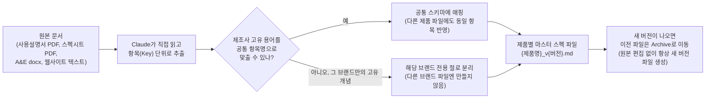

# Audio Equipment Spec Parsing Skill

오디오 앰프(컨트롤러)·스피커 제품의 사양(스펙)을 제조사 원본 문서(사용설명서, 스펙시트, A&E 문서, 웹사이트)에서 추출해, **제품 1개당 파일 1개**의 통일된 마크다운 스펙 문서로 정리해 놓은 저장소입니다.

## 지금 뭘 보면 되나요

**제품별 최신 버전 `.md` 파일 하나만 보시면 됩니다.** 같은 제품 파일이 여러 버전(`_v1.0`, `_v1.1`, `_v2.2` 등)으로 존재하는데, **파일명 끝 버전 번호가 가장 높은 것이 최신**이고 그게 곧 "현재 확정된 스펙"입니다. 이전 버전들은 `Archive/` 폴더에 이력용으로만 보관되어 있으니 무시하셔도 됩니다.

예: `LA12X_v3.3.md`가 있고 `Archive/LA12X/LA12X_v3.2.md`가 있다면, `v3.3.md`만 보시면 됩니다.

파일을 열면 상단에 표 형태로 Key(항목명) / Value(값) / Unit(단위)이 정리되어 있고, 표 아래 "주석 및 출처" 절에 그 값을 어느 원본 문서 몇 페이지에서 가져왔는지, 측정 조건이 무엇인지가 적혀 있습니다. 값이 `null`이면 "확인 안 됨(원본에 없거나 못 찾음)"이고, 값이 `0`이면 "원본을 다 뒤져서 확인한 결과 실제로 없음(확정)"이라는 뜻으로 서로 구분해서 씁니다.

## 현재 보유 제품 목록 (2026-07-18 기준)

| 카테고리 | 브랜드 | 제품 수 | 최신 파일 위치 |
|---|---|---|---|
| 앰프 | L-Acoustics | 6 | [`amplifiers/LA/`](amplifiers/LA/) — LA1.16i, LA2Xi, LA4X, LA7.16, LA7.16i, LA12X |
| 앰프 | d&b audiotechnik | 10 | [`amplifiers/db/`](amplifiers/db/) — 5D, 5DM, 10D, 25D, 30D, 40D, D25, D40, D80, D90 |
| 스피커 | L-Acoustics | 41 | [`speakers/LA/`](speakers/LA/) — K/A/X/S/L 시리즈 및 서브우퍼 전반 |
| 스피커 | d&b audiotechnik | 2 | [`speakers/db/`](speakers/db/) — GSL8, GSL12 |
| 스피커 | Meyer Sound | 3 | [`speakers/MY/`](speakers/MY/) — PANTHER-L, PANTHER-M, PANTHER-W |

목록은 계속 갱신되므로, 정확한 최신 파일명은 해당 브랜드 폴더를 열어 버전 번호가 가장 높은 `.md` 파일을 확인하시면 됩니다.

## 어떤 방식으로 작업했나

원본 문서를 사람이 읽듯 Claude(AI)가 직접 읽고, 제조사마다 다른 용어를 하나의 공통 항목(Key) 체계로 맞춰 표로 정리하는 방식입니다. 값을 추측하거나 만들어내지 않고, 원본에서 확인되지 않으면 반드시 `null`로 남겨 "모른다"는 상태 자체를 데이터로 보존합니다.

작업 시 지키는 핵심 원칙:

- **추측 금지**: 모든 값은 그 제품 자신의 원본 문서에 실제로 적힌 내용에서만 가져옵니다. 다른 제품 값을 그냥 가져다 쓰지 않으며, 예외적으로 값을 가져오는 경우(예: 설치형 파생 모델이 스펙을 그대로 물려받는 경우)에도 반드시 근거를 각주로 남깁니다.
- **항목 체계 동기화**: 같은 계열로 묶여 관리되는 제품들은 항목(Key) 목록이 서로 동일하게 유지됩니다. 한 제품에서 새로운 항목이 발견되면, 다른 제품 파일에도 (해당 사항이 없으면 `null`로) 같이 반영합니다.
- **버전 관리**: 스펙을 수정할 때는 기존 파일을 건드리지 않고 반드시 새 버전 파일을 만든 뒤, 이전 파일은 `Archive/`로 옮깁니다. 그래서 언제든 이전 버전과 비교하며 무엇이 왜 바뀌었는지 추적할 수 있습니다.

## 참고 (안 보셔도 되는 것들)

폴더 구조나 원본 문서 보관 방식 같은 세부 규칙은 `CLAUDE.md`, `SKILL_v*.md`에 정의되어 있습니다 — 이건 이 저장소를 계속 업데이트하는 작업자(AI/사람)를 위한 내부 지침이니, 제품 스펙만 확인하실 분은 넘어가셔도 됩니다.
