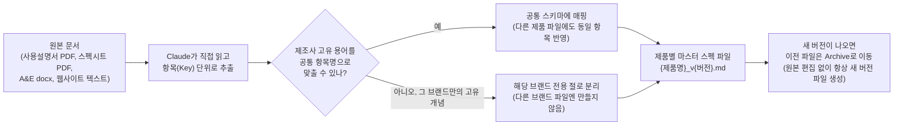
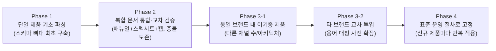

# Audio Equipment Spec Parsing Skill

오디오 앰프(컨트롤러)·스피커 제품의 사양(스펙)을 제조사 원본 문서(사용설명서, 스펙시트, A&E 문서, 웹사이트)에서 추출해, **제품 1개당 파일 1개**의 통일된 마크다운 스펙 문서로 정리해 놓은 저장소입니다.

## 지금 뭘 보면 되나요

**제품별 최신 버전 `.md` 파일 하나만 보시면 됩니다.** 같은 제품 파일이 여러 버전(`_v1.0`, `_v1.1`, `_v2.2` 등)으로 존재하는데, **파일명 끝 버전 번호가 가장 높은 것이 최신**이고 그게 곧 "현재 확정된 스펙"입니다. 이전 버전들은 `Archive/` 폴더에 이력용으로만 보관되어 있으니 무시하셔도 됩니다.

예: `LA12X_v3.3.md`가 있고 `Archive/LA12X/LA12X_v3.2.md`가 있다면, `v3.3.md`만 보시면 됩니다.

파일을 열면 상단에 표 형태로 Key(항목명) / Value(값) / Unit(단위)이 정리되어 있고, 표 아래 "주석 및 출처" 절에 그 값을 어느 원본 문서 몇 페이지에서 가져왔는지, 측정 조건이 무엇인지가 적혀 있습니다.

값이 `null`이면 "확인 안 됨(원본에 없거나 못 찾음, 있을 수도 없을 수도 있음)"이라는 뜻이고, 원본 문서를 전부 뒤져서 "실제로 없다"는 게 확정되면 `null` 대신 확정값을 적습니다 — 개수를 세는 항목(예: GPIO 포트 개수)이면 `0`으로, 있다/없다를 묻는 항목(예: 특정 기능 지원 여부)이면 `No`로 적으므로, 표를 훑어볼 때 `0`뿐 아니라 `No`도 "확인해봤는데 없더라"는 확정 답변으로 읽으시면 됩니다. 반대로 아직 `null`인 항목은 "없다고 확정한 게 아니라 그냥 원본에서 못 찾았다"는 뜻이니 혼동하지 않으셔도 됩니다. 파일 맨 아래 `## Null Report`는 그 파일에서 확인이 안 된 항목이 몇 개나 되는지 한눈에 보여주는 요약이고, `## 버전 변경 이력`은 그 제품 파일이 어떤 이유로 몇 번 갱신됐는지의 로그입니다.

## 현재 보유 제품 목록 (2026-07-18 기준, 총 67개)

| 카테고리 | 브랜드 | 제품 수 | 폴더 |
|---|---|---|---|
| 앰프 | L-Acoustics | 6 | [`amplifiers/LA/`](amplifiers/LA/) |
| 앰프 | d&b audiotechnik | 10 | [`amplifiers/db/`](amplifiers/db/) |
| 스피커 | L-Acoustics | 41 | [`speakers/LA/`](speakers/LA/) |
| 스피커 | d&b audiotechnik | 2 | [`speakers/db/`](speakers/db/) |
| 스피커 | Meyer Sound | 8 | [`speakers/MY/`](speakers/MY/) |

**앰프 — L-Acoustics**: LA1.16i, LA2Xi, LA4X, LA7.16, LA7.16i, LA12X

**앰프 — d&b audiotechnik**: 5D, 5DM, 10D, 25D, 30D, 40D, D25, D40, D80, D90

**스피커 — L-Acoustics** (시리즈별로 축약):
- K Series — K1, K2, K3, K3i, Kara II, Kara IIi, Kiva II, KS21, KS21i, KS28, L2, L2D (12개)
- A Series — A10/A15 Focus·Wide (8개)
- X Series — X4, X6, X8, X12, X15, 5XT (8개)
- Subwoofer — SB6, SB10, SB15, SB18 (7개)
- Colinear — Soka, Syva (5개)
- CS1 (1개)

**스피커 — d&b audiotechnik**: GSL8, GSL12

**스피커 — Meyer Sound**: PANTHER(L/M/W), TIGRA(L/W), LEOPARD(+M80), LINA

목록은 계속 갱신되므로, 정확한 최신 파일명은 해당 브랜드 폴더를 열어 버전 번호가 가장 높은 `.md` 파일을 확인하시면 됩니다.

## 어떤 방식으로 작업했나

원본 문서를 사람이 읽듯 Claude(AI)가 직접 읽고, 제조사마다 다른 용어를 하나의 공통 항목(Key) 체계로 맞춰 표로 정리하는 방식입니다. 값을 추측하거나 만들어내지 않고, 원본에서 확인되지 않으면 반드시 `null`로 남겨 "모른다"는 상태 자체를 데이터로 보존합니다.



작업 시 지키는 핵심 원칙:

- **추측 금지**: 모든 값은 그 제품 자신의 원본 문서에 실제로 적힌 내용에서만 가져옵니다. 다른 제품 값을 그냥 가져다 쓰지 않으며, 예외적으로 값을 가져오는 경우(예: 설치형 파생 모델이 스펙을 그대로 물려받는 경우)에도 반드시 근거를 각주로 남깁니다.
- **항목 체계 동기화**: 같은 계열로 묶여 관리되는 제품들은 항목(Key) 목록이 서로 동일하게 유지됩니다. 한 제품에서 새로운 항목이 발견되면, 다른 제품 파일에도 (해당 사항이 없으면 `null`로) 같이 반영합니다.
- **버전 관리**: 스펙을 수정할 때는 기존 파일을 건드리지 않고 반드시 새 버전 파일을 만든 뒤, 이전 파일은 `Archive/`로 옮깁니다. 그래서 언제든 이전 버전과 비교하며 무엇이 왜 바뀌었는지 추적할 수 있습니다.
- **이름으로 구조를 짐작하지 않음**: 제품명이 비슷하다고 내부 구조(능동/수동, 커넥터 종류, 카디오이드 방식 등)가 같을 거라 가정하지 않고, 매번 그 제품 자신의 원본 문서를 다시 확인합니다. 실제로 이름만 보고 짐작했다가 틀렸던 사례가 있어(d&b의 "X" 계열과 "XD" 계열이 이름은 비슷해도 네트워크 프로토콜·커넥터가 전혀 다름) 이 원칙이 생겼습니다.

### 진행 단계 (Phase 1~4)

새 제품·브랜드를 투입할 때 아래 순서로 스키마를 점진적으로 넓혀왔습니다. 처음부터 모든 브랜드의 스펙 체계를 예측해서 설계한 게 아니라, 제품을 하나씩 실제로 파싱해보면서 "어디까지가 브랜드 공통 개념이고 어디부터가 그 브랜드만의 고유 개념인지"를 계속 검증하며 스키마를 다듬어가는 방식입니다.



- **Phase 1 — 단일 제품 기초 파싱**: 카테고리(앰프/스피커)마다 최초 제품 1개를 골라 마스터 스키마의 뼈대(어떤 항목들을 다룰지)를 처음 설계합니다.
- **Phase 2 — 복합 문서 통합**: 매뉴얼, 스펙시트, A&E 문서, 웹사이트처럼 여러 출처에서 같은 제품 정보를 가져올 때, 서로 다른 값이 나오면 하나를 임의로 버리지 않고 둘 다 보존한 뒤 어느 쪽을 채택했는지 근거를 남기는 방식을 이 단계에서 확립했습니다.
- **Phase 3-1 — 동일 브랜드 내 이기종 제품**: 같은 회사 제품이라도 채널 수나 구동 방식이 다른 제품(예: L-Acoustics의 4채널 앰프 대비 16채널 앰프)을 투입해, 신규 항목이 나오면 기존 제품 파일에도 양방향으로 반영해 항목 목록을 100% 맞추는 절차를 세웠습니다.
- **Phase 3-2 — 타 브랜드 교차 투입**: 완전히 다른 제조사(d&b audiotechnik, Meyer Sound 등)의 제품을 투입해 그 브랜드만의 용어·측정 기준을 확인하고, 필요하면 해당 브랜드 전용 항목을 새로 만듭니다. 이 과정에서 "브랜드 무관 공통 개념"과 "그 브랜드만의 고유 설계"를 구분하는 기준이 다듬어졌습니다.
- **Phase 4 — 표준 운영**: Phase 3까지 확립한 절차(원본 재확인, 양방향 동기화, 버전 관리)를 이후 모든 신규 제품 투입에 반복 적용하는 표준 루틴으로 고정한 단계입니다. 현재 67개 제품 대부분이 이 단계에서 투입됐습니다.

### 작업 관리 (TODO.md)

저장소 루트의 `TODO.md`에는 "지금 진행 중이거나 다음에 할 일"만 남겨둡니다. 작업이 끝나면 곧바로 `TODO_Archive.md`로 옮겨 기록하기 때문에, TODO.md만 보면 항상 현재 상태를 빠르게 파악할 수 있습니다. 그동안 어떤 작업들이 있었는지 업데이트 이력이 궁금하시면 `TODO_Archive.md`를 확인하시면 됩니다.

## 폴더 구조

제품 폴더 하나(`{카테고리}/{브랜드}/`)를 예로 들면 이렇게 생겼습니다:

```
amplifiers/LA/                     ← 카테고리(amplifiers) / 브랜드(LA = L-Acoustics)
├── LA12X_v3.3.md                  ← ★ 최신 스펙 파일 (이것만 보면 됨)
├── LA7.16_v2.4.md                 ← ★ 같은 폴더 안에 제품별로 이런 파일이 나열됨
├── Original_PDFs/
│   └── LA12X/                     ← LA12X의 원본 매뉴얼·스펙시트 PDF (절대 수정 안 함)
├── Raw_Web_Data/
│   └── LA12X_Raw_Web_Data.md      ← LA12X 웹사이트 스펙 원문 (가공 없이 그대로)
└── Archive/
    └── LA12X/
        └── LA12X_v3.2.md          ← LA12X의 예전 버전들 (참고용, 안 보셔도 됨)
```

- **최신 스펙 파일**(`{제품명}_v{버전}.md`)은 브랜드 폴더 바로 아래에 있습니다 — 위 표의 링크를 눌러 폴더를 열면 바로 보입니다.
- **`Original_PDFs/{제품명}/`**: 그 제품의 원본 문서(사용설명서 PDF, 스펙시트 PDF, A&E docx)를 가공 없이 그대로 보관합니다. 정리된 `.md` 파일을 만들 때도 이 원본 자체는 절대 수정하지 않으므로, 마크다운의 어떤 값이든 실제 원본 몇 페이지에서 나왔는지 직접 열어서 대조할 수 있습니다.
- **`Raw_Web_Data/`**: 웹사이트에서 그대로 긁어온 스펙 원문(정리/요약 없이).
- **`Archive/{제품명}/`**: 그 제품의 예전 버전 스펙 파일들. 최신 파일만 보실 거면 무시하셔도 됩니다.

전체 저장소는 이 패턴이 카테고리(`amplifiers/`, `speakers/`) × 브랜드(`LA`, `db`, `MY`)별로 반복되는 구조입니다. 저장소 루트에는 이런 제품 폴더들 외에 `README.md`/`CLAUDE.md`/`SKILL_v*.md`/`TODO.md`/`TODO_Archive.md`/`Session_Transfer_v*.md`처럼 프로젝트 전체를 관리하는 파일들만 있습니다.

## 버전 관리 방식

파일명은 `{제품명}_v{Major}.{Minor}.md` 형식을 씁니다(`_latest`, `_final` 같은 태그는 쓰지 않음). 숫자가 오르는 기준은 이렇습니다:

- **Minor**(예: v3.2 → v3.3): 값 하나를 정정하거나 항목을 추가하는 등 기존 내용과 호환되는 변경.
- **Major**(예: v2.x → v3.0): 섹션 구성 자체를 바꾸거나 파싱 규칙을 크게 뜯어고치는 변경.

기존 파일을 열어서 바로 고치는 일은 하지 않습니다 — 값 하나만 바뀌더라도 항상 아래 순서를 따릅니다:


그래서 `Archive/{제품명}/` 폴더에는 그 제품이 처음 만들어진 v1.0부터 지금까지의 모든 버전이 순서대로 남아있고, 최신 파일 맨 아래 `## 버전 변경 이력` 표에서 "몇 버전에서 무엇이 왜 바뀌었는지"를 전부 추적할 수 있습니다.

## 참고 (안 보셔도 되는 것들)

폴더 구조나 원본 문서 보관 방식, Phase별 상세 체크리스트 같은 세부 규칙은 `CLAUDE.md`, `SKILL_v*.md`에 정의되어 있습니다 — 이건 이 저장소를 계속 업데이트하는 작업자(AI/사람)를 위한 내부 지침이니, 제품 스펙만 확인하실 분은 넘어가셔도 됩니다.
